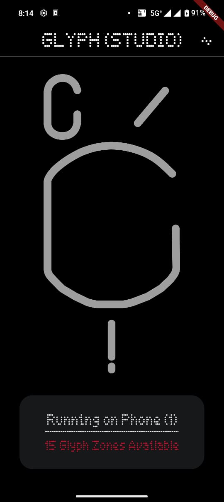
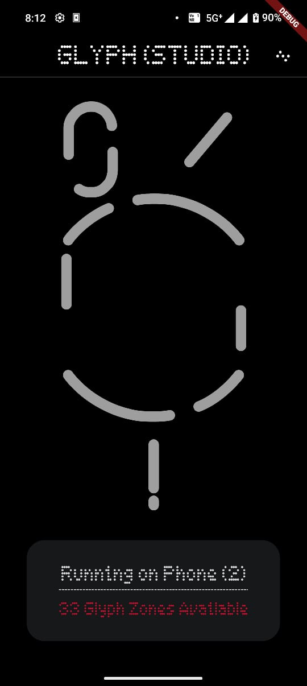
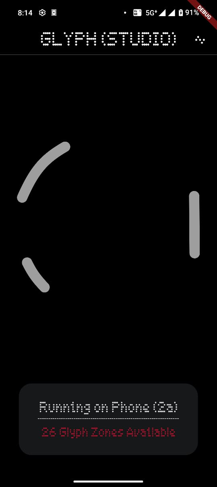

# Nothing™ Glyph Studio

Your playground for everything Glyphs. A Nothing™ (Community) Project.

| Phone (1)                          | Phone (2)                          | Phone (2a)                          |
|------------------------------------|------------------------------------|-------------------------------------|
|    |    |    |

## Sneak Peek

https://github.com/SyedAhkam/glyph-studio/assets/52673095/86f1463a-8592-4ce5-94a4-e63d91ff414b

## Features

- Support for Phone (1), Phone (2), and Phone (2a) glyph layouts.
- Absolute control over Glyphs (long-term goal)
- Allow recording & playing back Flows.
- Community built Flows (Planned)
- Intuitive, user-friendly Nothing inspired design.
- Powered by [Nothing Glyph Developer Kit](https://github.com/Nothing-Developer-Programme/Glyph-Developer-Kit) and [this flutter wrapper](https://github.com/JayKay135/flutter-nothing-glyph-interface).

## Build Instructions

1. Setup the Android and the Flutter SDK. If you're on Nix, there's a flake available that will set up the environment for you.
2. Run `flutter run` or `flutter build apk` if you prefer building an APK directly.
3. The app will launch.

Since we don't have production API keys from Nothing yet -- in order to run it on our devices, we have to enable [Glyph Interface debugging mode](https://github.com/Nothing-Developer-Programme/Glyph-Developer-Kit?tab=readme-ov-file#setup-instructions).

``` sh
adb shell settings put global nt_glyph_interface_debug_enable 1
```

Note: Glyph debug mode expires after every 48 hours. 

## Develop notes

Trigger code generation for assets using:

``` sh
dart run build_runner build
```


## Legal

'Nothing', Nothing Phones, Nothing Fonts, Nothing Glyphs are intellectual properties of Nothing™ Technology Private Limited. I have no right over them.

This codebase is MIT licensed.
